# TerraFarming

Bem-vindo ao TerraFarming, a plataforma web que transforma a agricultura tradicional em uma agricultura inteligente e sustentável. Utilizando tecnologias de ponta como NextJS, React, Tailwind CSS e AWS Bedrock, oferecemos soluções inovadoras para otimizar e automatizar o gerenciamento de culturas através de dispositivos IoT.

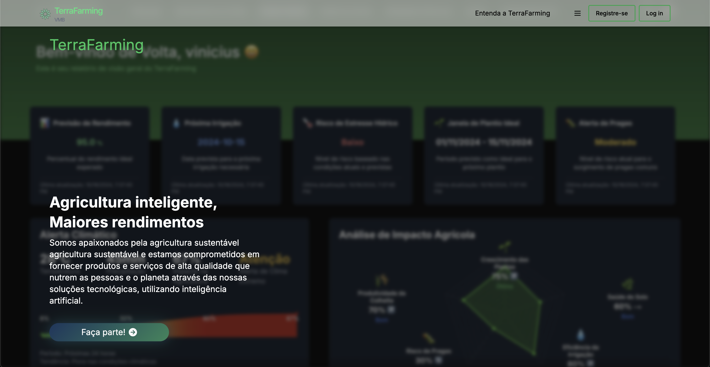

## Índice

- [Visão Geral](#visão-geral)
- [Gerenciamento de Tarefas](#gerenciamento-de-tarefas)
- [Análise Preditiva](#análise-preditiva)
- [Gestão de Culturas](#gestão-de-culturas)
- [Marketplace & Recursos](#marketplace-recursos)
- [FarmingTec](#farmingtec)
- [Configurações & IoT](#configurações-iot)
- [IÁgrix: Seu Assistente Inteligente](#iágrix-seu-assistente-inteligente)
- [Tecnologias Utilizadas](#tecnologias-utilizadas)
- [Instalação](#instalação)
- [Contribuição](#contribuição)
- [Licença](#licença)

## Porque o Terrafarming ?
Conheça as nossas soluções accesando o nosso site através do "Entenda a TerraFarming"


## Visão Geral

Facilidade no acesso: 
- Acesse o TerraFarming por meio da sua conta do Google ou login por meio do sua email cadastrado na plataforma.

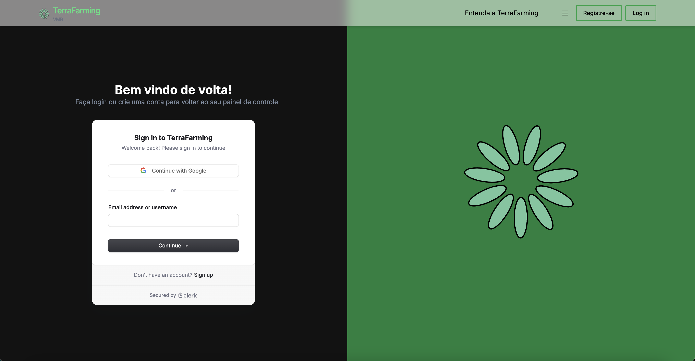

A plataforma TerraFarming oferece uma visão completa do estado atual das suas plantações, integrando dados colhidos por sensores IoT que monitoram:

- Umidade do Solo
- Temperatura do Solo
- Luminosidade
- Temperatura do Ar
- Umidade do Ar

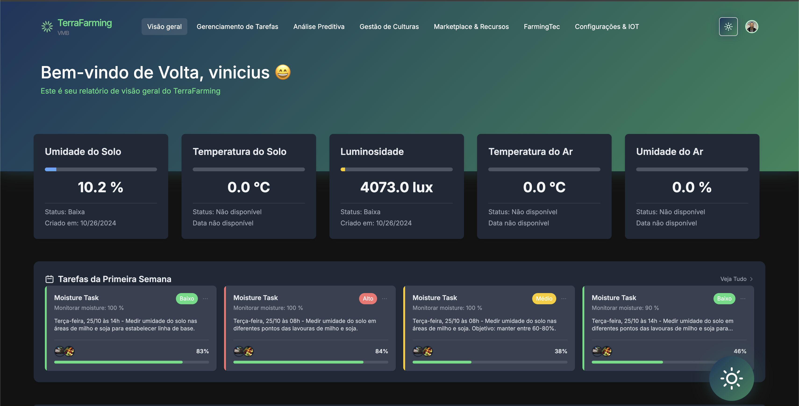

## Gerenciamento de Tarefas

Planeje e acompanhe suas atividades agrícolas com base em recomendações inteligentes geradas por nossa IA. As tarefas são priorizadas conforme as necessidades específicas da sua cultura.

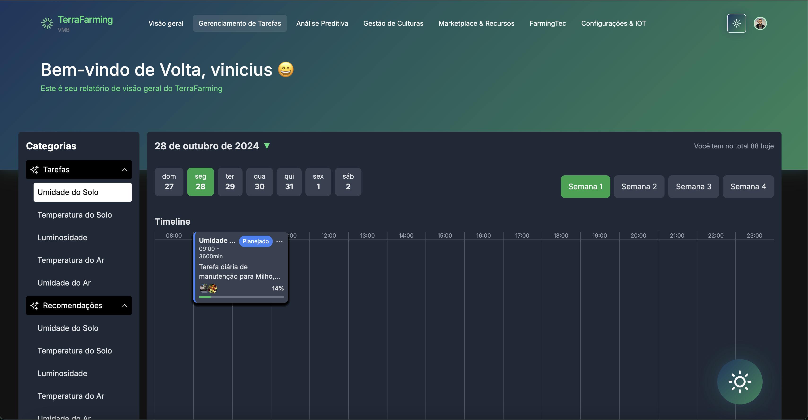

Utilize as recomendações para mais eficiência na sua agricultultura.

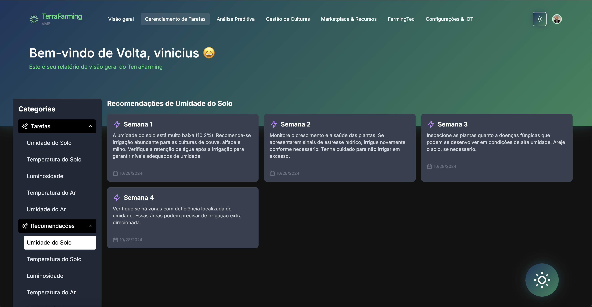

## Análise Preditiva

Utilize modelos preditivos para antecipar necessidades e riscos, maximizando a produtividade e minimizando desperdícios. Nossa IA analisa dados históricos e atuais para fornecer insights valiosos.

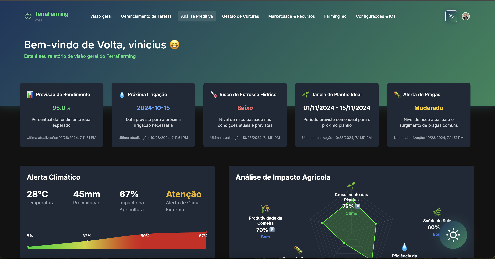

Obtenha relatórios avançados de análise preditiva sobre a saúde da sua agricultura.

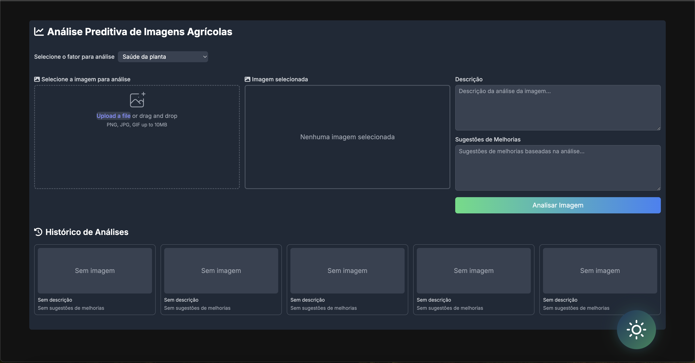

## Gestão de Culturas

Monitore a saúde e o desenvolvimento das suas plantações em tempo real. Receba alertas e recomendações personalizadas para garantir o crescimento ideal das culturas.

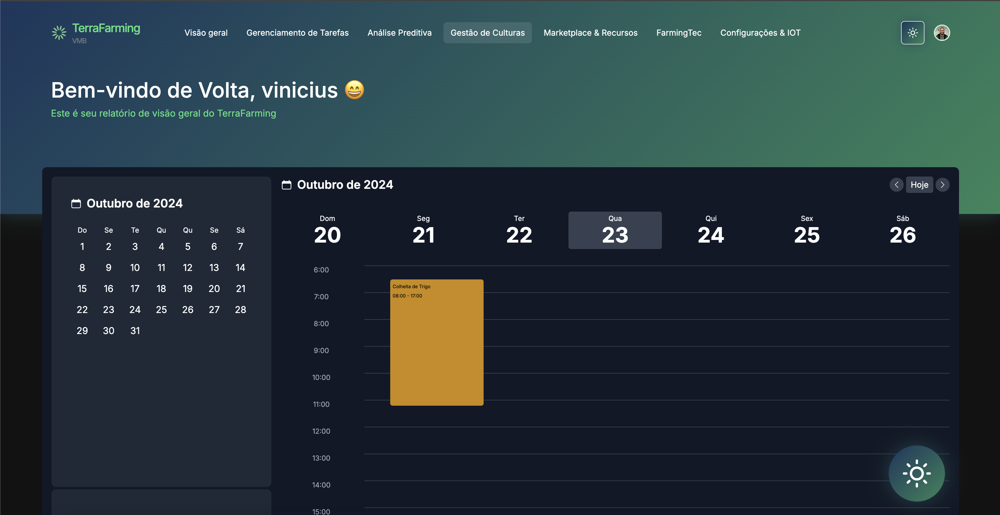

Obtenha um relatório sobre a cultura da sua agricultura.

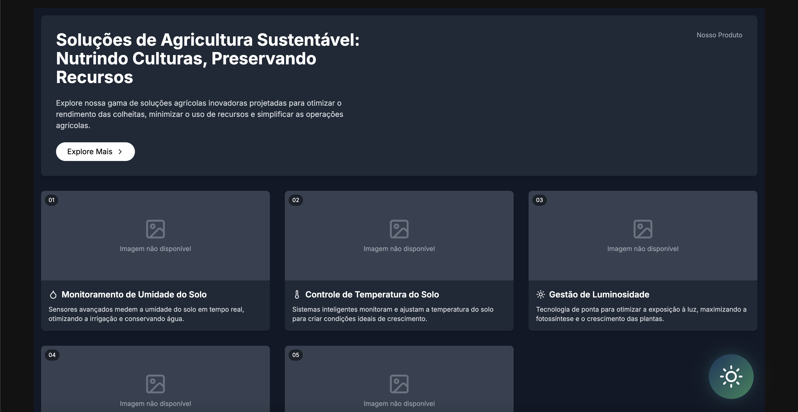

## Marketplace & Recursos

Acesse uma variedade de insumos, ferramentas e tecnologias agrícolas diretamente no nosso marketplace, facilitando a adoção de práticas agrícolas modernas.

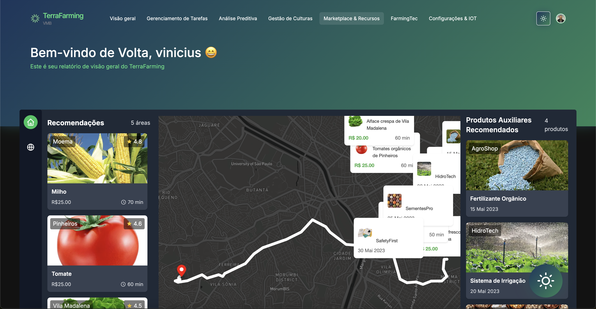

## FarmingTec

Explore tecnologias de ponta e inovações que ajudam a elevar suas práticas agrícolas a um novo patamar de eficiência e sustentabilidade.

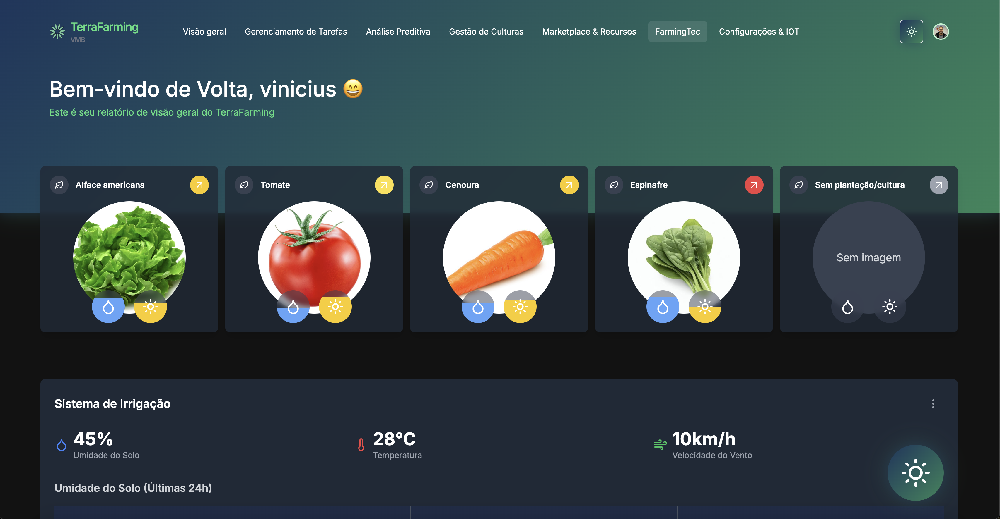

Só o TerraFarming pode te oferecer um sistema de análise preditiva para irrigação automatizada da sua agricultura.

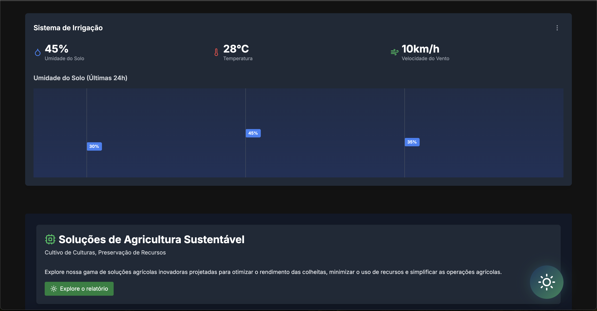

Acesse recursos de educativos de acordo com as métricas da sua agricultura.

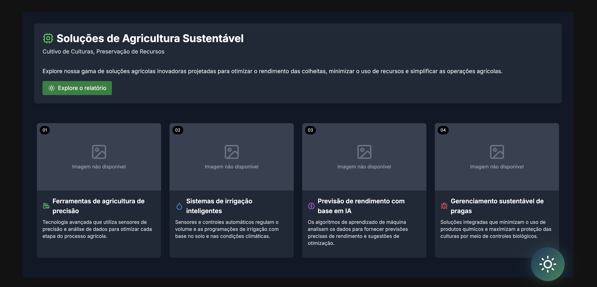

## Configurações & IoT

Personalize as configurações de dispositivos IoT e integre novos sensores ao seu sistema para melhorar o monitoramento e controle do ambiente agrícola.

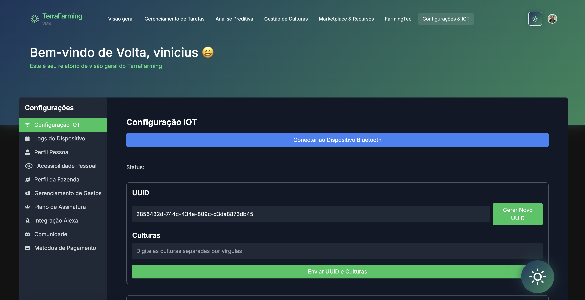

Coloque os cartões de pagamento que você preferir.

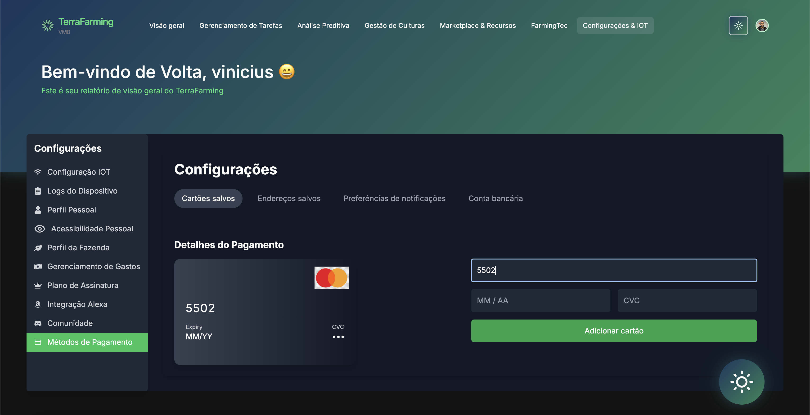

Interaja com outros agricultures em nossa comunidade para troca de conhecimentos e melhorias entre agriculturas.

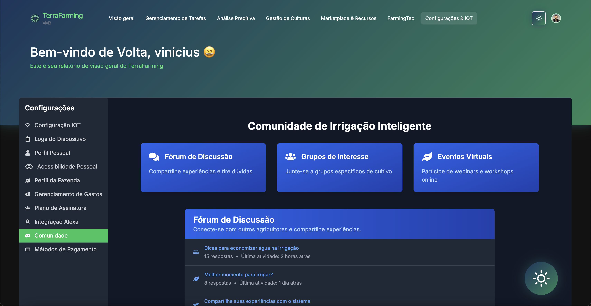

Saiba e execute suas atividades e recomendações de uma maneira muito fácil e acessível, integrando sua conta do TerraFarming com a Alexa.
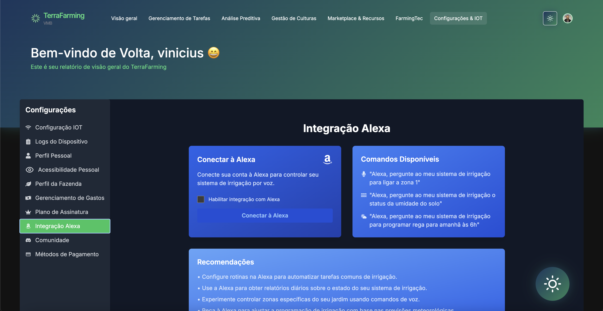

Um checkout personalizado para pagamentos rápidos e efetivos.


## IÁgrix: Seu Assistente Inteligente

IÁgrix é o assistente de inteligência artificial do TerraFarming, projetado para gerenciar todos os dados agrícolas de forma eficiente. Ele oferece suporte generalizado, ajudando a otimizar processos e a tomar decisões informadas. Com análises em tempo real, IÁgrix fornece recomendações personalizadas para:

- Irrigação e manejo de água
- Fertilização e uso de nutrientes
- Prevenção e controle de pragas
- Planejamento de colheitas

A inteligência de IÁgrix garante que você obtenha o máximo de suas operações agrícolas, aumentando a produtividade e promovendo a sustentabilidade.


## Tecnologias Utilizadas

- **NextJS** e **React**: Para a construção da interface web moderna e responsiva.
- **Tailwind CSS**: Para estilização rápida e eficiente.
- **AWS Bedrock**: Para implementação de inteligência artificial e aprendizado de máquina.
- **IoT Devices**: Para coleta de dados ambientais em tempo real.

## Instalação

1. Clone o repositório:

   ```bash
   git clone https://github.com/seu-usuario/terrafarming.git